# MonKey - Orbital 2022

_Author:_

- [Nguyen Quy Duc](https://github.com/ngquyduc)
- [Bui Duc Thanh](https://github.com/bdthanh)

## Programme Diagram

### Authentication

### Activity Flow

### Firestore Collections Structure

## Core Features

### 1. Authentication

#### Screenshots

     

          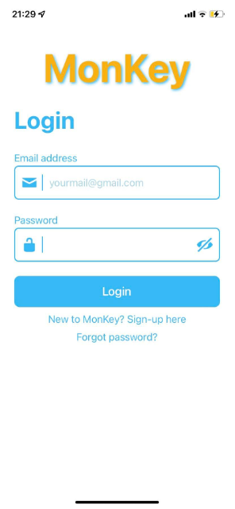
     

     

          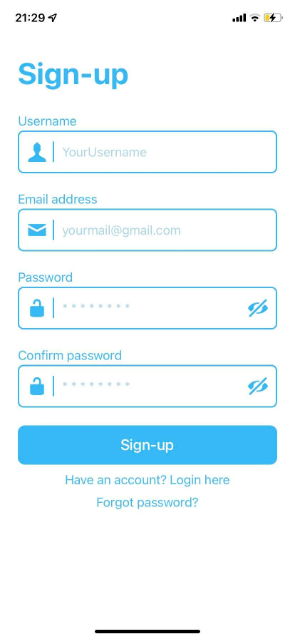
     

     

          
     

#### Highlights

- Streamlined user registration: Email-based account creation and seamless signup process.
- Effortless access: Upon signup, users are directed to the home page without additional logins.
- Password management: Password reset via email link; option to logout and switch accounts.

### 2. Home

#### Screenshot

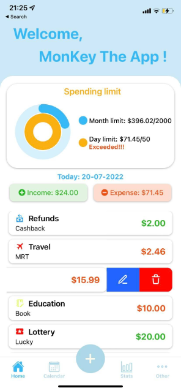

#### Highlights

- Instant financial overview: View daily transactions, income, and expenses effortlessly.
- Smart spending tracking: Visualize spending vs. set limits via progress rings.
- Detailed transaction insight: Comprehensive list of today's records with category, note, and amounts.

#### Add-ons

- Change Limit

  

_Users have the option to personalize month/day limits in this section._

- Edit Item

  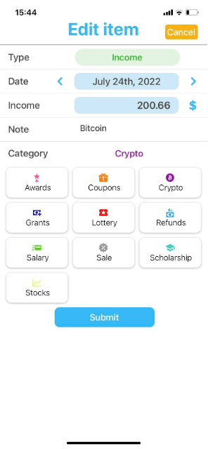

_Users can edit their previous records_

### 3. Calendar

#### Screenshots

     

          
     

     

          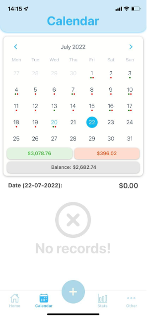
     

#### Highlights

- Efficient historical check: Users access past transactions through the calendar feature.
- Insightful calendar view: Half-screen layout displays month's income, expenses, and balance; dated dots represent recorded items.
- Detailed daily exploration: Date selection reveals transactions and balance, with swipe-left options for editing or deletion, akin to Home Screen.

### 4. Input

#### Screenshots

     

          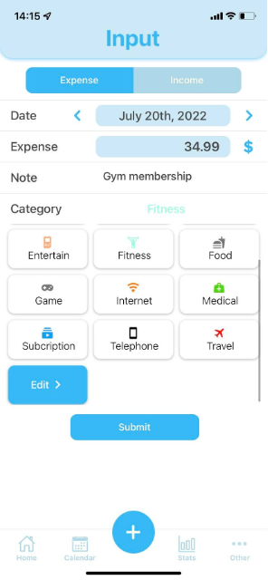
     

     

          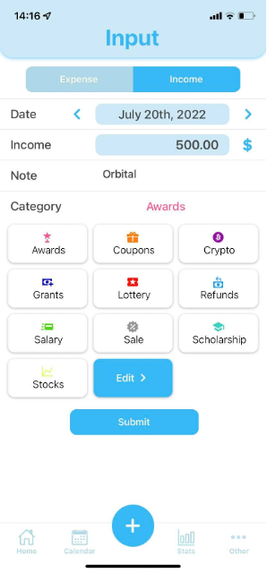
     

     

          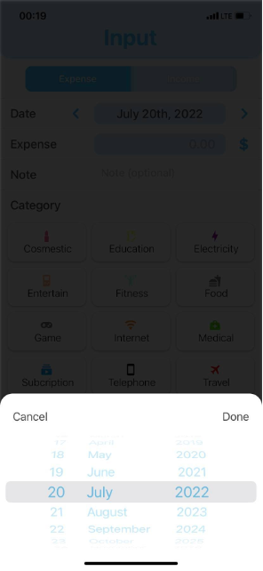
     

#### Highlights

- Core input functionality: Vital for app completion and testing.
- Effortless transaction recording: Users note date, amount, optional note, and category.
- Built-in category selection: Predefined income and expense categories.
- Enhanced category interface: Post-Milestone 2 update for improved visuals and scrolling.
- User customization: List personalization via edit button, leading to described edit screen.
- Nested scroll solution: Addressed issue with nested scrollviews using pop-up date picker.

### 5. Statistics

#### Highlights

     

          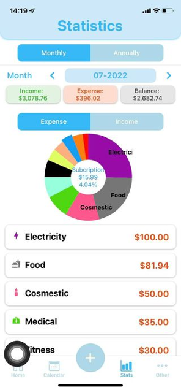
     

     

          
     

     

          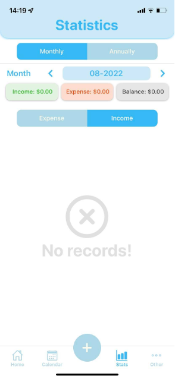
     

#### Highlights

- Comprehensive transaction statistics: Monthly and annual insights through pie charts.
- Interactive details: Clicking on pie sections reveals category specifics.
- Sorted category list: Monthly/yearly categories ranked by amount.

### 6. Others

#### Screenshots

     

          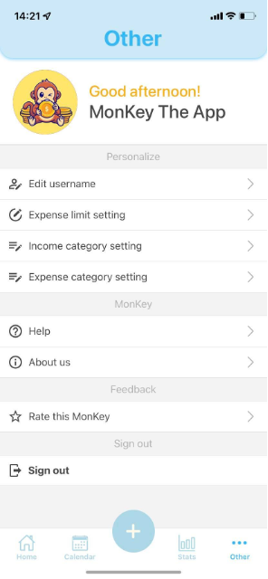
     

     

          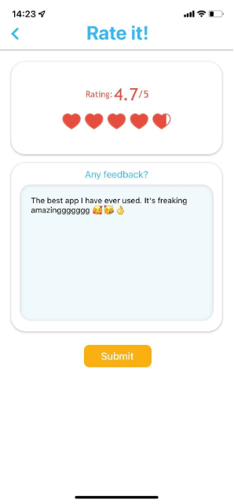
     

#### Highlights

- Personalization options: Customize username, limits, and category list.
- User ratings: Provide feedback and ratings for app improvement.
- Convenient sign out: Easily log out and return to Login screen.

## Testing

#### 1. Automated Testing (Jest)

#### 2. Manual Testing

#### 3. User Testing

To see more details, please visit [Documentation](https://docs.google.com/document/d/1CKXTRehlMHOxHcnWnMPt7zqr7QvKcz9Jkj8ZyzlH88w/edit#heading=h.k9b4iio9ekot)
